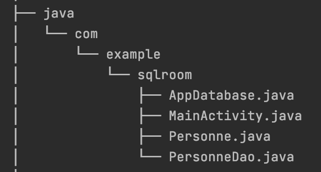
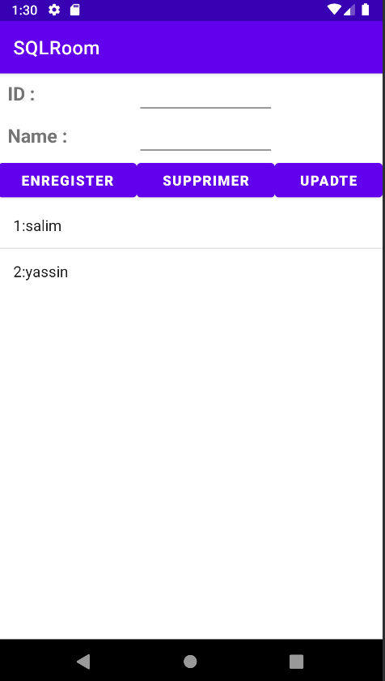

# Android Application by using SQLite Room
## Description
the main of this application is to save data in database by using concept of ORM.
in this application we try to use SQLite Room the manage our data by __ORM__ concept.
## tree

## Instruction
to use SQLite Room you need to add those dependencies to you __build.gradle__
`def room_version = "2.4.2"`
`implementation "androidx.room:room-runtime:$room_version"`
`annotationProcessor "androidx.room:room-compiler:$room_version"`

## Application Screen

